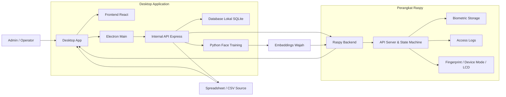
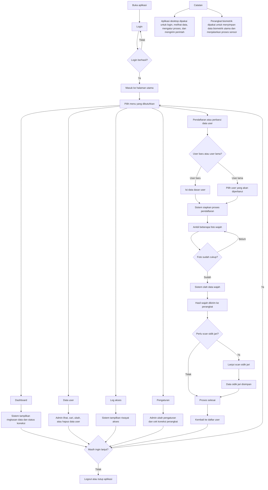
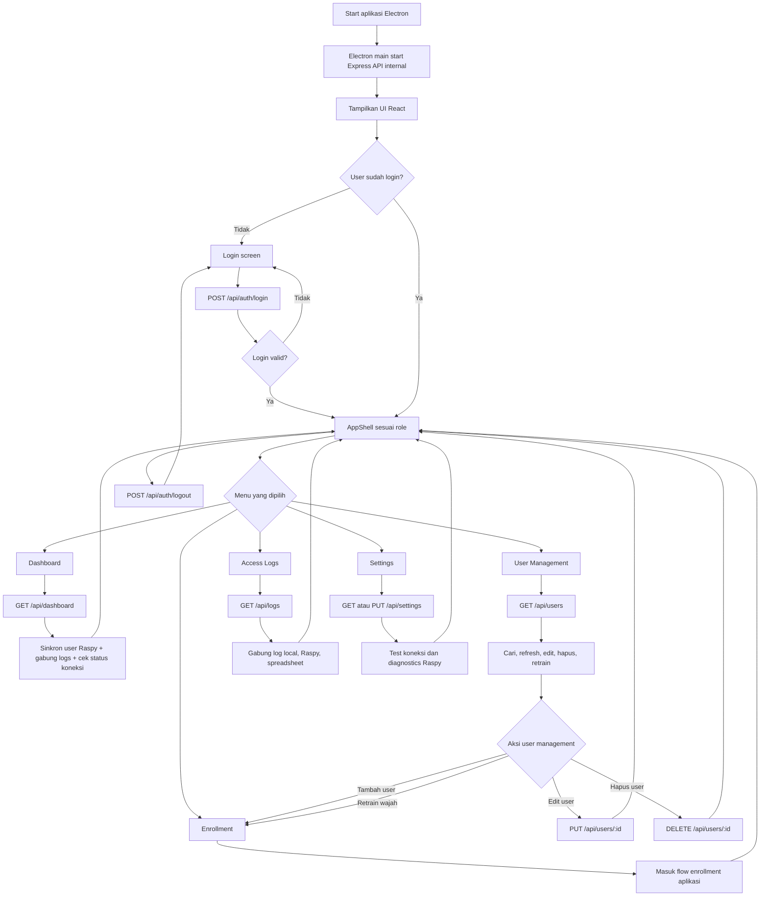
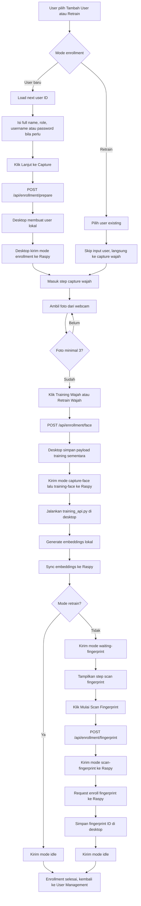
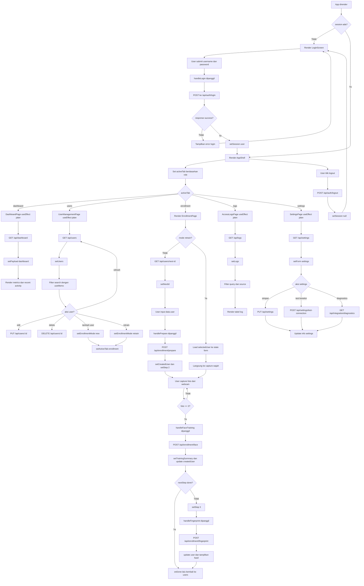

# Rekap Implementasi dan PR Lanjutan

Tanggal pembaruan: 13 April 2026

## 1. Ringkasan Singkat

Workspace ini sekarang sudah berkembang dari sekadar prototype menjadi fondasi aplikasi desktop admin biometrik yang terhubung ke sistem Raspy.

Keputusan arsitektur yang dipakai saat ini:

- Raspy menjadi source of truth untuk data biometrik dan operasional alat.
- Desktop app menjadi panel admin, monitor, dan orchestrator proses enrollment.
- Training wajah tetap bisa dijalankan di desktop, lalu hasil akhir embeddings dikirim ke Raspy.
- Login admin dan coadmin tetap dikelola lokal di desktop, tidak disinkronkan ke Raspy.

Secara umum, fondasi utama sudah selesai. Yang tersisa sekarang adalah penyempurnaan integrasi, sinkronisasi data tampilan tertentu, dan hardening sebelum packaging menjadi installer desktop.

---

## 2. Arsitektur Saat Ini

### 2.1 Desktop App

Komponen utama desktop app:

- Frontend React: [src/App.tsx](src/App.tsx)
- Styling utama: [src/index.css](src/index.css)
- Electron main process: [electron/main.ts](electron/main.ts)
- API internal desktop: [electron/api.ts](electron/api.ts)
- Database lokal desktop: [electron/database.ts](electron/database.ts)

Peran desktop app saat ini:

- Login admin dan coadmin
- Dashboard monitoring
- User management
- Enrollment user baru
- Retrain wajah
- Access logs viewer
- Settings integrasi Raspy dan spreadsheet
- Diagnostics koneksi Raspy

### 2.2 Raspy

Berdasarkan update terbaru Anda, seluruh sisi Raspy dipusatkan di `main_integrated.py`.

Peran Raspy saat ini:

- API server untuk desktop
- State machine alat
- Device mode dan status LCD
- Penyimpanan biometrik utama
- Penyimpanan data user biometrik utama
- Penyimpanan dan akses `embeddings.pkl`
- Pengelolaan log akses

### 2.3 Source of Truth

Source of truth yang berlaku saat ini:

- Data biometrik user: Raspy
- User biometrik utama: Raspy
- Device mode/status alat: Raspy
- Face embeddings final: Raspy
- Login admin/coadmin desktop: lokal desktop

### 2.4 Flowchart Aplikasi Desktop

### 2.4 Blok Diagram Sistem

Blok diagram ini lebih cocok dipakai di manual book, presentasi, atau dokumen overview karena menampilkan hubungan antar komponen utama tanpa masuk ke detail alur proses.



#### Ringkasan hubungan antar blok

- Admin atau operator menggunakan desktop app sebagai panel utama.
- Frontend React menampilkan UI, sedangkan Electron dan internal API menangani logika desktop.
- Database lokal menyimpan akun login admin atau coadmin dan data lokal pendukung.
- Proses training wajah berjalan di desktop melalui modul Python.
- Hasil embeddings dikirim ke Raspy sebagai penyimpanan biometrik utama.
- Raspy menangani state machine alat, data biometrik utama, akses log, dan integrasi perangkat.
- Spreadsheet atau CSV menjadi sumber data tambahan untuk sinkronisasi log atau data eksternal.

Catatan penting:

- Flowchart di bawah ini khusus untuk aplikasi desktop admin.
- Flow alat, state machine sensor, LCD, kamera device, dan proses hardware Raspy tidak dibahas di sini.
- Titik akhir flow aplikasi adalah saat desktop memanggil API internal atau mengirim request ke Raspy.

#### Versi Ringkas dan Mudah Dipahami

##### Flowchart Gabungan Sederhana



#### Flowchart Aplikasi Utama



#### Flowchart Enrollment di Aplikasi



#### Batas Flow Aplikasi vs Flow Alat

Pemisah utamanya seperti ini:

- Aplikasi desktop menangani login, navigasi halaman, input admin, capture webcam, trigger training, sinkronisasi data, dan tampilan hasil.
- Raspy menangani mode alat, operasi sensor fingerprint, penyimpanan biometrik utama, dan state machine perangkat.
- Jadi pada flowchart aplikasi, node seperti `notifyRaspyMode`, `syncRemoteFaceEmbeddings`, dan `enrollRemoteFingerprint` adalah titik handoff ke flow alat.

#### Flowchart Logika Instruksi Program Aplikasi

Flowchart ini lebih tepat jika yang ingin digambarkan adalah urutan logika instruksi program komputer, yaitu fokus pada apa yang dilakukan kode di sisi aplikasi desktop.



#### Prompt untuk Generate Flowchart Aplikasi

Kalau Anda mau generate ulang atau minta AI lain bikin versi flowchart aplikasi, pakai prompt ini:

```text
Buat flowchart aplikasi desktop berdasarkan logika kode yang benar-benar ada di project ini, bukan flow alat, bukan flow bisnis, dan bukan asumsi umum.

Project ini adalah aplikasi desktop Electron + React + TypeScript dengan Express API internal.

Struktur yang harus dijadikan acuan:
- Frontend utama ada di src/App.tsx
- Electron main process ada di electron/main.ts
- Internal API ada di electron/api.ts

Tujuan flowchart:
Menunjukkan urutan logika instruksi program komputer dari saat aplikasi dibuka sampai logout, dengan fokus pada apa yang dilakukan kode aplikasi desktop.

Aturan penting:
- Gunakan hanya alur yang memang ada di kode.
- Jangan menambahkan proses yang tidak ada di project.
- Jangan mengubah nama halaman, state, handler, atau endpoint.
- Jangan membahas detail hardware alat.
- Jika ada interaksi ke Raspy, tampilkan hanya sebagai request API atau handoff dari aplikasi.
- Flowchart harus berfokus pada render komponen, event handler, useEffect, request API, perubahan state, dan perpindahan tampilan.

Komponen dan alur utama yang wajib tercermin:

1. Startup aplikasi
- Electron app start
- createWindow dipanggil
- startServer dipanggil dari electron/main.ts
- Express API internal aktif di port 3001
- UI React dirender

2. Root app flow di src/App.tsx
- App dirender
- cek state session
- jika session null maka Render LoginScreen
- jika session ada maka Render AppShell

3. Login flow
- user submit form login
- handleLogin dipanggil
- frontend call POST /api/auth/login
- jika gagal tampilkan error login
- jika sukses setSession user
- tampilkan toast login berhasil

4. Logout flow
- user klik logout
- POST /api/auth/logout
- setSession null
- kembali render LoginScreen

5. AppShell flow
- set activeTab awal berdasarkan role
- role admin default ke dashboard
- role coadmin default ke users
- jika role bukan admin maka dashboard, logs, dan settings tidak boleh aktif
- Sidebar memanggil onSelect untuk pindah tab

6. Tab dan halaman yang memang ada
- dashboard
- users
- enrollment
- logs
- settings

7. Dashboard flow
- DashboardPage render
- useEffect load dashboard
- GET /api/dashboard
- setPayload dashboard
- render metrics totalUsers, attendanceToday, systemStatus
- render recentActivity

8. User management flow
- UserManagementPage render
- useEffect load users
- GET /api/users
- setUsers
- search difilter via useMemo
- aksi refresh memanggil loadUsers lagi
- aksi edit memanggil PUT /api/users/:id
- aksi delete memanggil DELETE /api/users/:id
- aksi tambah user memanggil openNewEnrollment
- aksi retrain memanggil openRetrain
- openNewEnrollment mengubah enrollmentMode menjadi new, selectedUser null, lalu setActiveTab enrollment
- openRetrain mengubah enrollmentMode menjadi retrain, set selectedUser, lalu setActiveTab enrollment

9. Enrollment flow
- EnrollmentPage render
- mode enrollment bisa new atau retrain
- jika mode new maka useEffect load next id dengan GET /api/users/next-id
- state penting: step, nextId, createdUser, fullName, role, username, password, photos, statusMessage, trainingSummary
- handlePrepare memanggil POST /api/enrollment/prepare
- jika sukses setCreatedUser dan setStep 2
- user capture foto webcam ke state photos
- handleFaceTraining memanggil POST /api/enrollment/face
- jika sukses update createdUser, setTrainingSummary, cek nextStep
- jika nextStep done maka onDone dan kembali ke users
- jika nextStep fingerprint maka setStep 3
- handleFingerprint memanggil POST /api/enrollment/fingerprint
- jika sukses update user, tampilkan hasil, lalu onDone

10. Access logs flow
- AccessLogsPage render
- useEffect load logs
- GET /api/logs
- setLogs
- logs difilter berdasarkan query dan sourceFilter
- render tabel logs

11. Settings dan diagnostics flow
- SettingsPage render
- useEffect load settings
- GET /api/settings
- setForm settings
- simpan settings memanggil PUT /api/settings
- test koneksi memanggil POST /api/settings/test-connection
- diagnostics memanggil GET /api/integration/diagnostics
- hasil diagnostics disimpan ke state diagnostics

12. State penting yang harus disebut jika relevan di flowchart
- setSession
- setActiveTab
- setUsers
- setCreatedUser
- setStep
- setLogs
- setForm
- setPayload
- setTrainingSummary

Endpoint yang benar-benar ada dan boleh muncul di flowchart:
- POST /api/auth/login
- POST /api/auth/logout
- GET /api/dashboard
- GET /api/users
- GET /api/users/next-id
- PUT /api/users/:id
- DELETE /api/users/:id
- POST /api/enrollment/prepare
- POST /api/enrollment/face
- POST /api/enrollment/fingerprint
- GET /api/logs
- GET /api/settings
- PUT /api/settings
- POST /api/settings/test-connection
- GET /api/integration/diagnostics

Istilah yang dipakai dalam node flowchart harus berupa aksi kode, contohnya:
- Render LoginScreen
- App dirender
- handleLogin dipanggil
- POST /api/auth/login
- setSession user
- Render AppShell
- useEffect load users
- GET /api/users
- setUsers
- setActiveTab enrollment
- handlePrepare dipanggil
- POST /api/enrollment/prepare
- setCreatedUser dan setStep 2
- handleFaceTraining dipanggil
- POST /api/enrollment/face
- setTrainingSummary
- setStep 3
- handleFingerprint dipanggil
- POST /api/enrollment/fingerprint

Output yang saya inginkan:
- format Mermaid flowchart TD
- satu flowchart terpadu dari startup aplikasi sampai logout
- kalau perlu boleh pakai decision node seperti session ada atau tidak, role admin atau tidak, mode retrain atau tidak, dan nextStep done atau fingerprint
- jangan buat terlalu abstrak, harus cukup detail sehingga orang bisa menelusuri perilaku kode aplikasi ini

Jangan hasilkan flowchart alat. Jangan jelaskan sensor, LCD, state machine device, atau proses internal hardware Raspy.
```

---

## 3. Yang Sudah Dikerjakan di Desktop

### 3.1 Login dan Role-Based Access

Sudah dibuat sistem login lokal desktop dengan role:

- Admin
- CoAdmin

Hak akses saat ini:

- Admin: akses penuh ke seluruh fitur desktop
- CoAdmin: akses ke user management dan enrollment

Implementasi utama:

- [electron/database.ts](electron/database.ts)
- [src/App.tsx](src/App.tsx)

Catatan:

- Auth desktop tidak disinkronkan ke Raspy sesuai keputusan arsitektur.
- Database lokal desktop menyimpan akun login, role, dan metadata user untuk kebutuhan panel admin.

### 3.2 Dashboard

Dashboard sudah disederhanakan sesuai requirement utama.

Yang ditampilkan saat ini:

- Total Users
- Attendance Today
- System Status

Yang sudah dihapus dari desain awal:

- Enrollment status
- Training status di dashboard utama

Status implementasi:

- Sumber data dashboard sudah diarahkan lewat API internal desktop.
- Total users dan status alat sudah mengikuti struktur integrasi Raspy.
- Recent Activity sudah ada, tetapi belum final mengikuti spreadsheet sebagai sumber yang diinginkan.

File terkait:

- [src/App.tsx](src/App.tsx)
- [electron/api.ts](electron/api.ts)

### 3.3 User Management

Halaman user management sudah dibuat dengan fitur inti:

- Menampilkan user terdaftar
- Menampilkan role
- Menampilkan status login
- Menampilkan status face enrollment
- Menampilkan status fingerprint enrollment
- Menampilkan source data
- Admin bisa edit user
- Admin bisa hapus user
- Admin bisa buka retrain wajah
- CoAdmin hanya view dan tambah user baru

Status integrasi:

- Daftar user sudah diarahkan ke data Raspy via desktop API.
- Update user sekarang mengikuti endpoint Raspy.
- Delete user penuh sekarang mengikuti endpoint Raspy.
- Sinkronisasi lokal sudah menyesuaikan source of truth Raspy.

File terkait:

- [src/App.tsx](src/App.tsx)
- [electron/api.ts](electron/api.ts)
- [electron/database.ts](electron/database.ts)

### 3.4 Enrollment

Flow enrollment sudah dibangun sesuai kebutuhan utama:

1. Input data user
2. ID otomatis
3. Full Name wajib diisi
4. Capture wajah
5. Training wajah
6. Kirim hasil embeddings ke Raspy
7. Scan fingerprint
8. Kembali ke mode idle

Yang sudah diterapkan:

- Embeddings memakai nama lengkap sebagai key, bukan ID.
- Desktop menjalankan training wajah.
- Setelah training selesai, hasil embeddings dikirim ke Raspy.
- Device mode dikirim ke Raspy di tahap-tahap proses.

Status fingerprint:

- Jalur integrasi desktop ke endpoint fingerprint sudah dipasang.
- Namun operasional fingerprint masih tergantung environment Raspy, terutama availability `pyfingerprint`.

File terkait:

- [src/App.tsx](src/App.tsx)
- [electron/api.ts](electron/api.ts)
- [embedding_extractor/training_api.py](embedding_extractor/training_api.py)
- [embedding_extractor/embedding_store.py](embedding_extractor/embedding_store.py)

### 3.5 Access Logs

Halaman access logs sudah dibuat dan menampilkan data gabungan dari:

- local logs desktop
- logs Raspy
- spreadsheet CSV jika diaktifkan

Status saat ini:

- Page access logs sudah tersedia dan berfungsi.
- Parsing logs dari Raspy sudah tersambung.
- Parsing spreadsheet CSV sudah ada.

Kondisi yang belum final:

- Dashboard Recent Activity belum sepenuhnya mengikuti spreadsheet sesuai target akhir.

File terkait:

- [src/App.tsx](src/App.tsx)
- [electron/api.ts](electron/api.ts)

### 3.6 Settings dan Diagnostics

Sudah ditambahkan halaman settings khusus admin untuk mengatur koneksi integrasi.

Field yang tersedia:

- `raspy_api_base_url`
- `raspy_mode_endpoint`
- `spreadsheet_csv_url`
- `spreadsheet_enabled`

Tools yang tersedia dari desktop:

- Test koneksi Raspy
- Diagnostics integrasi Raspy

Diagnostics saat ini mengecek:

- health endpoint
- users endpoint
- logs endpoint
- device mode read
- device mode write

File terkait:

- [src/App.tsx](src/App.tsx)
- [electron/api.ts](electron/api.ts)
- [src/index.css](src/index.css)

---

## 4. Yang Sudah Dikerjakan di Integrasi Desktop ke Raspy

Desktop sudah disesuaikan ke kontrak API Raspy terbaru.

### 4.1 Endpoint yang Sudah Disesuaikan

Desktop sekarang sudah memakai endpoint Raspy berikut:

- `GET /api/health`
- `GET /api/users`
- `PUT /api/users/:id`
- `POST /api/update-user` sebagai fallback
- `DELETE /api/users/:id`
- `POST /api/add-user`
- `POST /api/enroll-face`
- `POST /api/device/mode`
- `GET /api/logs`

### 4.2 Device Mode yang Sudah Dipakai dari Desktop

Desktop sudah mengirim mode-mode berikut ke Raspy:

- `enrollment`
- `capture-face`
- `training-face`
- `waiting-fingerprint`
- `scan-fingerprint`
- `idle`

### 4.3 Face Sync

Alur yang berlaku sekarang:

- Desktop capture foto
- Desktop training embeddings
- Hasil akhir embeddings dikirim ke Raspy melalui `POST /api/enroll-face`
- Payload kiriman memakai:
  - `user_id`
  - `full_name`
  - `embeddings_file_base64`

### 4.4 Next User ID

Perhitungan `nextId` di desktop sekarang mencoba membaca user Raspy terlebih dahulu agar ID user baru tetap mengikuti source of truth.

### 4.5 Status Koneksi Aktual Saat Ini

Saat dokumen ini dibuat, diagnostics desktop masih menunjukkan koneksi Raspy gagal karena base URL masih mengarah ke localhost desktop.

Nilai yang masih aktif saat test terakhir:

- `http://127.0.0.1:5000`

Implikasi:

- Desktop siap untuk integrasi
- Tetapi belum menunjuk ke IP Raspy yang sebenarnya
- Sehingga test koneksi, users, logs, dan device mode masih `fetch failed`

---

## 5. Bug dan Perbaikan Teknis yang Sudah Diselesaikan

### 5.1 Crash Electron karena sql.js

Masalah:

- Electron main sempat crash dengan `UnhandledPromiseRejectionWarning`
- Root cause ada pada bundling `sql.js`

Perbaikan:

- Loading `sql.js` dipindahkan ke runtime load yang aman
- Error startup Electron sekarang ditangani eksplisit

File terkait:

- [electron/database.ts](electron/database.ts)
- [electron/main.ts](electron/main.ts)

### 5.2 Perapihan UI

Sudah dilakukan perapihan untuk:

- toolbar
- tombol
- tabel
- search field
- Settings page
- diagnostics card

Khusus search box:

- ikon kaca pembesar dipindah ke kanan
- ukuran kotak diperkecil agar tidak terlalu melebar

File terkait:

- [src/index.css](src/index.css)

---

## 6. Yang Belum Selesai

Bagian berikut belum final atau masih perlu dibenahi:

### 6.1 Recent Activity Dashboard Belum Final Mengikuti Spreadsheet

Status saat ini:

- Access Logs page sudah bisa baca gabungan local, Raspy, dan spreadsheet
- Tetapi blok `Recent Activity` di dashboard belum final mengikuti spreadsheet sesuai target akhir

Ini adalah PR fungsional utama yang masih tertinggal.

### 6.2 Fingerprint Belum Dijamin Jalan Penuh

Status saat ini:

- Jalur API desktop ke fingerprint sudah ada
- Tetapi environment Raspy masih perlu `pyfingerprint` agar operasi sensor fingerprint normal

Artinya:

- Flow desktop sudah siap
- Operasional alat fingerprint masih tergantung setup environment Raspy

### 6.3 Hardening Failure State

Masih perlu penyempurnaan pada skenario:

- Raspy offline saat user management dibuka
- Raspy offline saat enrollment berjalan
- Device mode gagal dikirim
- enroll face berhasil lokal tapi gagal sync ke Raspy
- logs/spreadsheet timeout

### 6.4 Granular Delete Biometrik Belum Dibuka di UI

Raspy sudah punya endpoint granular untuk face dan fingerprint, tetapi UI desktop saat ini belum menyediakan tombol khusus untuk:

- hapus face saja
- hapus fingerprint saja

### 6.5 Testing End-to-End Nyata ke IP Raspy Belum Dilakukan

Desktop sudah siap untuk test, tetapi verifikasi nyata terhadap IP Raspy belum dilakukan karena base URL yang terpasang masih localhost desktop.

---

## 7. PR Lanjutan yang Direkomendasikan

Berikut backlog yang paling logis dari kondisi sekarang.

### Prioritas 1: Benahi Recent Activity agar Mengikuti Spreadsheet

Target:

- Dashboard `Recent Activity` benar-benar membaca sumber yang Anda inginkan
- Aturan prioritas sumber data ditetapkan jelas

Pertanyaan desain yang perlu diputuskan saat implementasi:

- Apakah `Recent Activity` harus murni dari spreadsheet?
- Atau gabungan spreadsheet dan Raspy?
- Jika dua sumber sama-sama ada, mana yang diprioritaskan?

### Prioritas 2: Uji End-to-End Nyata ke Raspy

Setelah IP Raspy diisi di settings, lakukan pengujian ini:

1. `GET /api/health`
2. `GET /api/users`
3. tambah user
4. edit user
5. hapus user
6. kirim device mode
7. training wajah lalu sync ke Raspy

Tujuan:

- memastikan contract desktop dan Raspy benar-benar sinkron

### Prioritas 3: Failure Handling dan UX Errors

Yang perlu dibenahi:

- pesan error lebih eksplisit per endpoint
- retry untuk koneksi tertentu
- fallback tampilan ketika Raspy offline
- indikator status koneksi yang lebih jelas di UI

### Prioritas 4: Granular Biometric Management di UI

Tambahkan tombol atau aksi untuk:

- hapus face saja
- hapus fingerprint saja

Ini penting untuk maintenance user tanpa harus menghapus user penuh.

### Prioritas 5: Hardening Enrollment Flow

Yang perlu dipastikan:

- training lokal gagal tidak meninggalkan state setengah jalan
- sync face ke Raspy gagal tampil jelas dan bisa diulang
- fingerprint skip atau error tertangani tanpa merusak user record

---

## 8. Roadmap Sebelum Packaging Menjadi Installer Desktop

Sebelum dibuat installer untuk dipasang di PC mana pun, sebaiknya tahapan berikut diselesaikan dulu.

### Tahap A: Stabilkan Integrasi

- semua endpoint Raspy yang dipakai desktop harus lolos test nyata
- recent activity final harus sesuai requirement
- enrollment harus stabil
- diagnostics harus akurat

### Tahap B: Stabilkan Operasional

- failure state jelas
- error handling rapi
- setting koneksi bisa disimpan dan dipakai ulang
- UI final cukup rapi dan konsisten

### Tahap C: Packaging

Setelah dua tahap di atas aman, baru lanjut:

- build production Electron
- konfigurasi `electron-builder`
- generate installer Windows
- uji install di PC lain
- verifikasi path, permission, dan runtime dependency

Catatan:

- packaging sebaiknya dilakukan setelah koneksi Raspy dan spreadsheet sudah benar-benar stabil
- jangan packaging final saat flow face sync dan recent activity masih berubah-ubah

---

## 9. Kesimpulan Status Saat Ini

Status keseluruhan proyek saat ini:

- Fondasi aplikasi desktop: selesai
- Integrasi dasar desktop ke Raspy: selesai
- Settings dan diagnostics: selesai
- Role-based admin panel: selesai
- User management utama: selesai
- Enrollment utama: selesai
- Face sync ke Raspy: selesai
- Access logs page: selesai
- Recent Activity dashboard dari spreadsheet: belum final
- Fingerprint runtime environment Raspy: belum final
- Packaging installer desktop: belum dimulai

Kesimpulan praktis:

Proyek sudah berada di fase finishing integrasi dan hardening, bukan lagi fase pembangunan inti.

PR paling penting berikutnya:

- benahi `Recent Activity`
- verifikasi koneksi nyata ke IP Raspy
- stabilkan semua flow yang masih bergantung environment
- setelah itu baru packaging installer desktop

---

## 10. Checklist PR Berikutnya

Checklist kerja yang paling tepat setelah dokumen ini:

- isi `raspy_api_base_url` dengan IP Raspy yang benar dari halaman Settings
- jalankan diagnostics ulang dari desktop
- verifikasi `GET /api/users` dari Raspy
- verifikasi update user dari desktop
- verifikasi delete user dari desktop
- verifikasi `POST /api/device/mode`
- verifikasi enroll face end-to-end
- benahi `Recent Activity` agar mengikuti spreadsheet sesuai rule final
- stabilkan error handling offline/failure state
- baru lanjut packaging menjadi installer desktop
